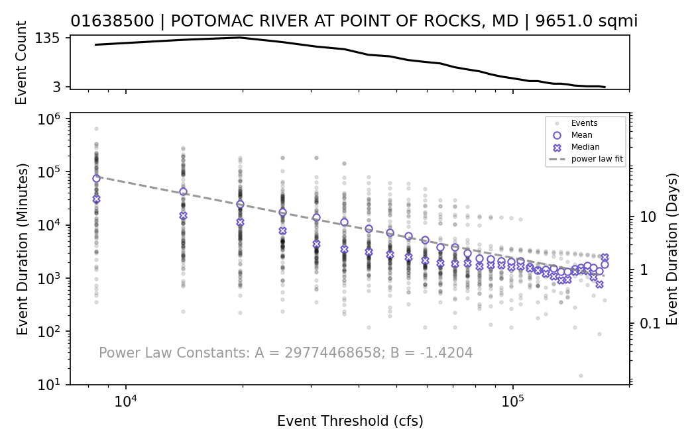

# The Duration-Over-Threshold Model

## Overview
`dotmodel` is the python library for applying the Duration-Over-Threshold model (Lawson et al., 2024).  The 
Duration-Over-Threshold model is a hierarchical statistical model that characterizes the return period of a given 
flowrate being exceeded for a given duration.  The current functionality of this library includes:

* Querying site and flowrate data from USGS National Water Information Service (NWIS) REST API.
* Cleaning flowrate records.
* Extracting and attributing flood events from a flowrate record.
* Estimating parameters of the Duration-Over-Threshold model from flood event series.
* Plotting of the Duration-Over-Model fit.
* Calculating relationships between flowrate, duration, and recurrence interval.

For a detailed explanation of this model, please see the open-access article from Lawson et al. (2024).

## Example

The example below downloads relevant data for USGS gage 01638500 (Potomac River at Point of Rocks, MD), cleans the 
timeseries, and estimates the Duration-Over-Threshold model parameters.

```python
from dotmodel import Gage

db_path = r'01638500.db'
potomac = Gage(db_path)
potomac.download_nwis('01638500', '10-01')
potomac.clean_timeseries()
potomac.flow_frequency_analysis(truncation_arrival_rate=2)
potomac.duration_analysis()
```

The model fit may then be plotted.


```python
potomac.plot_flow_frequency('01638500_ffa.png')
```

```python
potomac.plot_duration_power_law('01638500_duration.png')
```

```python
potomac.plot_model_summary('01638500.png')
```


## Installation

`muskingumcunge` can be installed using pip:
	
    $ python3 -m pip install dotmodel

or conda:

    $ conda install -c conda-forge dotmodel

## Issue tracker

Any bugs, suggestions, or questions may be logged using the issues tab

https://github.com/sclaw/duration-over-threshold/issues